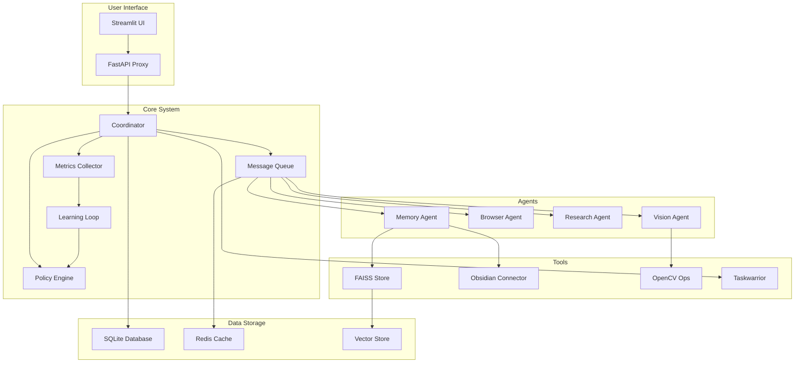
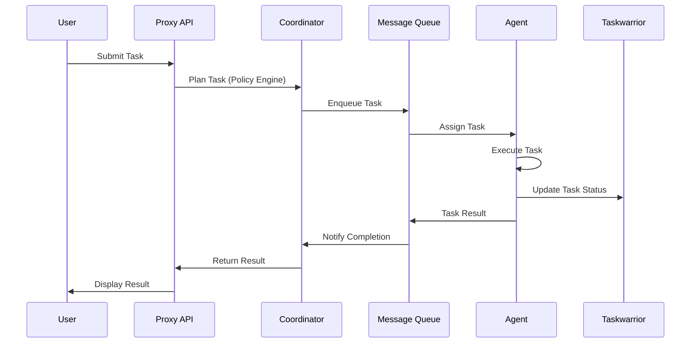
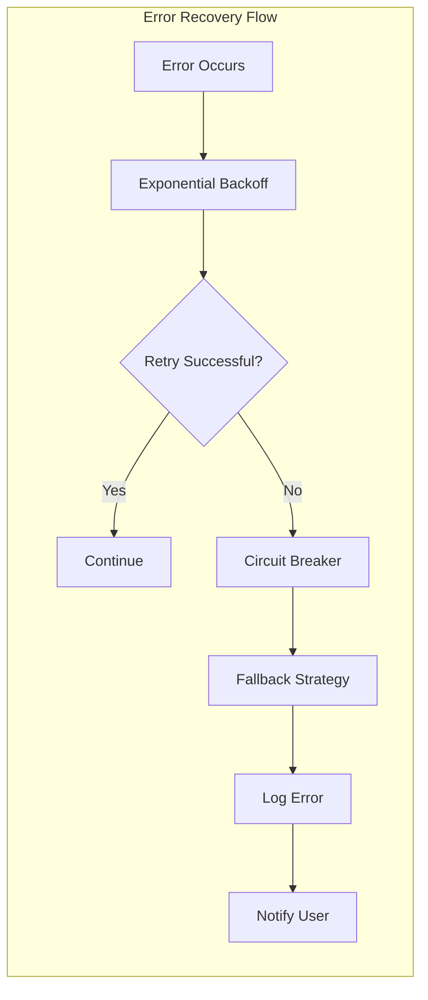

# Agentic System Implementation Plan

## Executive Summary

This plan outlines the systematic improvement of the Agentic System codebase across 70 prioritized tasks. The system has a solid foundation but requires significant enhancements to become robust, maintainable, and user-friendly.

## System Architecture Overview



## Prioritized Implementation Phases

### Phase 1: Immediate Blockers (Critical Fixes)
**Priority: HIGH - Must be fixed immediately**

1. **Fix NameError in `core/error_recovery.py`**
   - Move `ValidationError` and `ConfigurationError` definitions above `ExponentialBackoffStrategy`
   - Ensure proper class definition order

2. **Correct database path in `apps/proxy_api/main.py`**
   - Update path to: `os.path.join(os.path.dirname(os.path.dirname(os.path.dirname(__file__))), "data", "core.db")`
   - Test database connectivity

3. **Add `faiss-cpu` to `requirements.txt`**
   - Add dependency: `faiss-cpu>=1.7.4`
   - Verify FAISS functionality

4. **Standardize tests to use `pytest`**
   - Convert existing unittest tests to pytest
   - Add pytest configuration file
   - Ensure test discovery works

5. **Refactor `main.py` busy-waiting**
   - Replace `time.sleep()` loops with event-driven mechanisms
   - Use threading events or asyncio for coordination
   - Implement proper service lifecycle management

6. **Simplify `TaskwarriorError` handling**
   - Use string representation from `taskw` library
   - Reduce complex exception handling logic

### Phase 2: Core Functionality
**Priority: HIGH - Essential system operations**

7. **Add Chat UI page to Streamlit app**
   - Create new chat interface
   - Implement message history
   - Add real-time conversation handling

8. **Implement embedding model in memory agent**
   - Add proper embedding generation in `search_vectors`
   - Use sentence-transformers or similar library
   - Ensure vector similarity search works correctly

9. **Implement OCR in OpenCV ops**
   - Add Tesseract OCR integration
   - Implement text extraction from images
   - Handle multiple image formats

10. **Improve database connection pool**
    - Add connection waiting mechanism
    - Implement connection timeout handling
    - Add connection health checks

11-23. **Complete task execution pipeline**
    - Implement task routing logic
    - Add task coordination mechanisms
    - Integrate Taskwarrior properly
    - Implement Policy Engine selection
    - Add GitHub sync functionality

### Phase 3: UI/UX Improvements
**Priority: MEDIUM - User-facing enhancements**

24-36. **Streamlit UI enhancements**
    - Display conversation history
    - Add thinking indicators
    - Show agent status and logs
    - Implement dark mode
    - Add time range selection for metrics
    - Improve error handling with user-friendly messages

### Phase 4: Testing & Reliability
**Priority: MEDIUM - Quality assurance**

37-48. **Comprehensive testing strategy**
    - Add unit tests for all UI components
    - Implement integration tests for API
    - Create end-to-end test suite
    - Set up CI/CD pipeline
    - Add health check endpoints
    - Implement structured logging

### Phase 5: Code Quality & Maintainability
**Priority: MEDIUM - Technical debt reduction**

49-56. **Code quality improvements**
    - Refactor `main.py` for modularity
    - Add dependency injection framework
    - Implement comprehensive type hints
    - Enforce code style with linters
    - Add docstrings throughout codebase
    - Remove unused code and update dependencies

### Phase 6: Documentation & Onboarding
**Priority: LOW - Project health**

57-61. **Documentation enhancements**
    - Expand README with detailed setup instructions
    - Add CONTRIBUTING.md and CODE_OF_CONDUCT.md
    - Increase code comments for complex logic
    - Create architecture documentation

### Phase 7: Features & Enhancements
**Priority: LOW - Future capabilities**

62-70. **Advanced features**
    - Add support for additional agents and tools
    - Integrate with more task systems (Jira, Trello)
    - Implement user authentication and RBAC
    - Add notification system
    - Create plugin system for extensibility

## Detailed Implementation Approach

### Task Execution Flow Improvement



### Error Recovery Strategy



## Technical Specifications

### Database Schema Updates
- **Tasks Table**: Add proper foreign key relationships
- **Metrics Table**: Add CPU/memory usage tracking
- **Agent Status Table**: Track agent availability and performance

### API Endpoint Implementation
```python
# Required endpoints for Phase 2
/tasks/{id} - GET, PUT, DELETE
/tasks/{id}/runs - GET (task execution history)
/plan - POST (task planning with Policy Engine)
/metrics - GET (system metrics)
/policy - GET, PUT (policy configuration)
/health - GET (system health check)
```

### Configuration Management
- **Environment variables** for sensitive data
- **Configuration files** for system settings
- **Dynamic configuration** reloading without restart

## Risk Assessment

### High Risk Items
1. **Database path correction** - Potential data loss if incorrect
2. **FAISS integration** - Dependency compatibility issues
3. **Task execution logic** - Complex coordination requirements

### Mitigation Strategies
- **Backup database** before making changes
- **Test FAISS integration** in isolated environment
- **Implement gradual rollout** for core functionality changes

## Success Metrics

### Phase Completion Criteria
- **Phase 1**: All critical errors resolved, system starts without issues
- **Phase 2**: Task execution pipeline fully functional
- **Phase 3**: UI provides complete user experience
- **Phase 4**: Test coverage >80%, CI/CD operational
- **Phase 5**: Code passes linting, type checking, and style guidelines
- **Phase 6**: Documentation enables new contributors to onboard quickly
- **Phase 7**: System extensible and ready for future enhancements

## Implementation Timeline

### Week 1: Phase 1 Completion
- Fix immediate blockers
- Test basic system functionality

### Week 2-3: Phase 2 Implementation
- Core functionality implementation
- Integration testing

### Week 4: Phase 3 UI Improvements
- Streamlit UI enhancements
- User acceptance testing

### Week 5: Phase 4 Testing
- Comprehensive test suite
- CI/CD setup

### Week 6: Phase 5 Code Quality
- Refactoring and code improvements
- Documentation updates

### Ongoing: Phases 6-7
- Documentation and feature enhancements

## Next Steps

1. **Review and approve** this implementation plan
2. **Begin Phase 1 implementation** with critical fixes
3. **Progress through phases** systematically
4. **Regular testing** at each phase completion
5. **User feedback** incorporation throughout process

This plan ensures the Agentic System becomes a robust, maintainable platform while preserving existing functionality and enabling future growth.